# CISC 468 — Secure P2P File Sharing: Architecture & Test Guide

---

## 1. Repository Structure

```
python_client/
├── requirements.txt          # Flask, cryptography, zeroconf, pytest
├── protocol_spec.md          # Wire protocol specification
├── ARCHITECTURE.md           # ← This file
├── shared/                   # Place files here to share them
├── received/                 # Incoming files land here
├── data/                     # Identity keys + vault storage
│   ├── identity_key.pem      # RSA-2048 private key (generated on first run)
│   └── vault/                # AES-256-GCM encrypted files
│       └── *.vault
│
└── app/
    ├── main.py               # Entry point: wires everything together
    │
    ├── core/                 # Application logic (no I/O)
    │   ├── state.py          # Central data model (singleton)
    │   ├── protocol.py       # Message schema, validation, serialization
    │   ├── session.py        # STS handshake state machine
    │   ├── consent.py        # Consent-based file transfer handlers
    │   ├── verification.py   # Third-party file verification
    │   └── revocation.py     # Key rotation & revocation
    │
    ├── crypto/               # Cryptographic primitives (stateless)
    │   ├── keys.py           # RSA-2048 generation, PEM, fingerprints
    │   ├── sign.py           # RSA-PSS sign / verify
    │   ├── hashing.py        # SHA-256 (bytes + streaming file)
    │   ├── kdf.py            # HKDF (sessions) + PBKDF2 (vault)
    │   └── encrypt.py        # AES-256-GCM AEAD
    │
    ├── network/              # Networking (I/O layer)
    │   ├── messages.py       # Message builder functions (14 types)
    │   ├── transport.py      # TCP server + length-prefixed wire format
    │   └── discovery.py      # mDNS peer discovery (zeroconf)
    │
    ├── storage/              # Persistent storage
    │   ├── files.py          # Shared file management + hashing
    │   ├── manifests.py      # Peer manifest storage + verification
    │   └── vault.py          # Encrypted at-rest storage (PBKDF2 → AES-GCM)
    │
    ├── ui/                   # Flask web UI
    │   ├── routes.py         # API endpoints + HTML routes
    │   ├── templates/
    │   │   ├── base.html     # HTML skeleton
    │   │   └── dashboard.html # Main UI
    │   └── static/
    │       ├── style.css     # Styling
    │       └── app.js        # Frontend polling + UI logic
    │
    └── tests/                # Automated tests (111 total)
        ├── test_crypto.py       # 35 tests — keys, signing, hashing, KDFs, STS
        ├── test_encrypt.py      # 15 tests — AES-256-GCM
        ├── test_protocol.py     # 32 tests — messages, validation, serialization
        ├── test_transport.py    #  6 tests — TCP loopback, server lifecycle
        ├── test_vault.py        # 15 tests — vault encrypt/decrypt, trust records
        └── test_verification.py #  8 tests — hash + signature verification
```

---

## 2. Module Purposes

### 2.1 `core/` — Application Logic

| Module | Purpose |
|--------|---------|
| **state.py** | Singleton `AppState` holding all runtime data: peers, shared files, transfers, consents, status log. Every other module reads/writes through this. |
| **protocol.py** | Single source of truth for the wire format. Defines 14 message types, payload schemas, JSON serialization, base64 encoding for binary fields. |
| **session.py** | Implements the **Station-to-Station (STS)** handshake: ephemeral ECDH (P-256) key exchange signed with long-term RSA-2048 keys. Produces a shared session key via HKDF. |
| **consent.py** | Handles the full consent workflow: incoming FILE_REQUEST → consent prompt → user approves → file sent. Contains message handlers for 6 message types. |
| **verification.py** | Third-party file verification: checks file hash + validates the original owner's RSA-PSS signature, even when the file was relayed by a different peer. |
| **revocation.py** | Key rotation: generates new RSA key, cross-signs with old key, notifies all contacts via REVOKE_KEY, handles incoming revocations with cross-signature validation. |

### 2.2 `crypto/` — Cryptographic Primitives

| Module | Purpose |
|--------|---------|
| **keys.py** | RSA-2048 keypair generation, PEM serialization/deserialization, save/load to disk (with optional password), SHA-256 fingerprinting. |
| **sign.py** | RSA-PSS signatures: `sign_data()` and `verify_signature()`. Used for STS handshake, file ownership, and key cross-signing. |
| **hashing.py** | SHA-256: `sha256_hash(bytes)` and `sha256_hash_file(path)` for streaming file hashing. |
| **kdf.py** | Two KDFs: **HKDF-SHA256** (session key derivation from ECDH shared secret) and **PBKDF2-HMAC-SHA256** (vault password → encryption key, 600K iterations). |
| **encrypt.py** | AES-256-GCM AEAD: `encrypt()`/`decrypt()` with 12-byte random nonce. `encrypt_file_payload()`/`decrypt_file_payload()` bind filename + hash as AAD. |

### 2.3 `network/` — Networking

| Module | Purpose |
|--------|---------|
| **messages.py** | Builder functions for all 14 protocol message types. Wraps `protocol.create_message()` so callers don't build raw dicts. |
| **transport.py** | TCP server with length-prefixed wire format: `[4-byte big-endian length][UTF-8 JSON]`. `TCPServer` accepts connections in background threads. |
| **discovery.py** | mDNS peer discovery via `zeroconf`. Advertises as `_p2pshare._tcp.local.`, browses for peers, updates `app_state.peers` on add/remove. |

### 2.4 `storage/` — Persistent Storage

| Module | Purpose |
|--------|---------|
| **files.py** | Manages the local shared file list: add/remove/scan `shared/` directory, SHA-256 hashing, RSA-PSS owner signatures. |
| **manifests.py** | Stores peer file manifests received via FILE_LIST_RESPONSE. Hash verification and owner signature verification. |
| **vault.py** | Encrypted at-rest storage: PBKDF2 → AES-256-GCM. Stores files, JSON data, and peer trust records. Format: `[salt][nonce][ciphertext+tag]`. |

### 2.5 `ui/` — Web Interface

| Module | Purpose |
|--------|---------|
| **routes.py** | Flask blueprint with all API endpoints (`/api/status`, `/api/add-shared-file`, `/api/request-file`, `/api/consent/...`, etc.) and the dashboard HTML route. |
| **dashboard.html** | Main UI: peer list, shared files, consent prompts, status log. |
| **app.js** | Frontend JS: polls `/api/status` every 2 seconds, renders peers/files/consents/status, handles button clicks. |

### 2.6 `main.py` — Entry Point

Wires everything together:
1. Generates/loads RSA identity keys
2. Starts the TCP server (background thread)
3. Starts mDNS discovery (background thread)
4. Registers the message dispatcher (routes 7 message types to handlers)
5. Launches the Flask web UI

---

## 3. Architecture Diagram

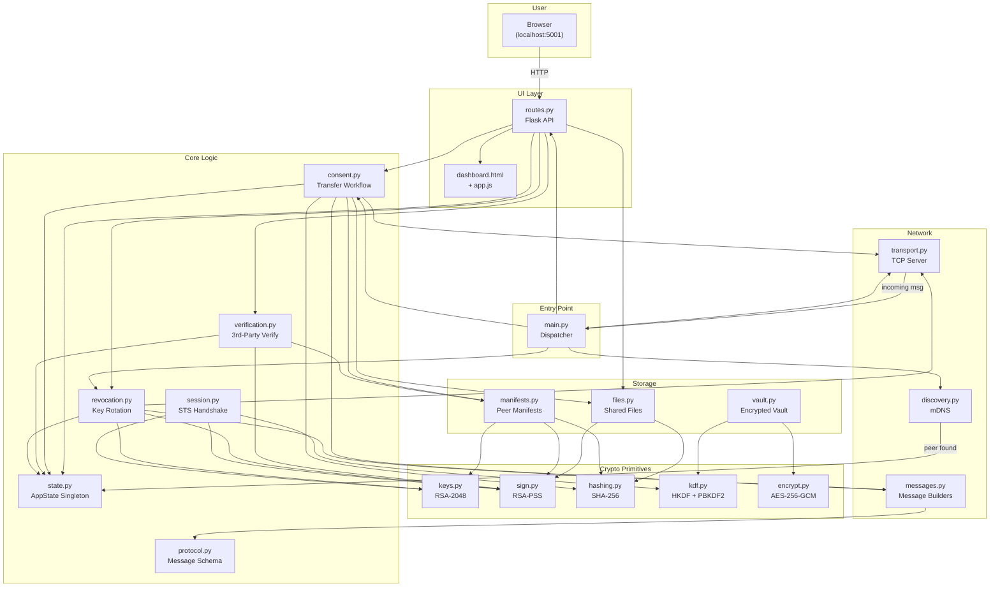

### Data Flow Summary

```
┌──────────┐      ┌──────────┐      ┌──────────┐      ┌──────────┐
│  Browser  │─HTTP─▶  routes  │─────▶│  core/*  │─────▶│ crypto/* │
│  (app.js) │◀─JSON─│  (.py)  │◀─────│          │◀─────│          │
└──────────┘      └──────────┘      └──────────┘      └──────────┘
                       │ ▲                │ ▲
                       │ │                │ │
                       ▼ │                ▼ │
                  ┌──────────┐      ┌──────────┐
                  │ storage/*│      │ network/*│
                  │          │      │  (TCP)   │
                  └──────────┘      └────┬─────┘
                                         │
                                    ┌────▼─────┐
                                    │  Remote   │
                                    │  Peers    │
                                    └──────────┘
```

**Key rule:** `crypto/` modules are stateless and pure. `core/` modules hold logic but access `state.py` for data. `network/` and `storage/` handle I/O. `ui/` connects the user to everything.

---

## 4. Reading Order

Read the codebase in this order. Each file builds on concepts from the files above it.

### Layer 1: Data Model
| # | File | Why read first |
|---|------|---------------|
| 1 | `core/state.py` | Defines every data structure: `PeerInfo`, `SharedFile`, `TransferRecord`, `ConsentRequest`, `AppState`. Everything references these. |
| 2 | `core/protocol.py` | Defines all 14 message types, their required fields, and how JSON serialization works (including base64 for binary data). |

### Layer 2: Crypto Primitives
| # | File | Why |
|---|------|-----|
| 3 | `crypto/keys.py` | RSA-2048 key generation and PEM serialization. Required to understand identity. |
| 4 | `crypto/sign.py` | RSA-PSS signatures — used everywhere (STS, file ownership, key revocation). |
| 5 | `crypto/hashing.py` | SHA-256 — used for file integrity and fingerprinting. |
| 6 | `crypto/kdf.py` | HKDF and PBKDF2 — key derivation for sessions and vault. |
| 7 | `crypto/encrypt.py` | AES-256-GCM — the cipher used for all encryption (transit + at-rest). |

### Layer 3: Networking
| # | File | Why |
|---|------|-----|
| 8 | `network/messages.py` | Builder functions that use `protocol.py` to create messages. |
| 9 | `network/transport.py` | TCP server and wire format. How messages physically travel between peers. |
| 10 | `network/discovery.py` | mDNS — how peers find each other on the LAN. |

### Layer 4: Storage
| # | File | Why |
|---|------|-----|
| 11 | `storage/files.py` | How files are added to the share list and hashed. |
| 12 | `storage/manifests.py` | How peer file lists are stored and verified. |
| 13 | `storage/vault.py` | Encrypted at-rest storage using PBKDF2 → AES-GCM. |

### Layer 5: Application Logic
| # | File | Why |
|---|------|-----|
| 14 | `core/session.py` | STS handshake — combines keys, signing, and KDF into a session. |
| 15 | `core/consent.py` | File transfer workflow — the core business logic. |
| 16 | `core/verification.py` | Third-party verification — combines signing, hashing, and manifests. |
| 17 | `core/revocation.py` | Key rotation — combines key generation, signing, and transport. |

### Layer 6: Integration
| # | File | Why |
|---|------|-----|
| 18 | `main.py` | Entry point — see how all modules are wired together. |
| 19 | `ui/routes.py` | API layer — see how the UI calls into core logic. |
| 20 | `ui/templates/dashboard.html` | HTML structure. |
| 21 | `ui/static/app.js` | Frontend polling and UI rendering. |

### Layer 7: Tests
| # | File | Why |
|---|------|-----|
| 22 | `tests/test_crypto.py` | Validates all crypto primitives + STS handshake. |
| 23 | `tests/test_encrypt.py` | Validates AES-256-GCM including AAD binding. |
| 24 | `tests/test_protocol.py` | Validates message creation, validation, and serialization. |
| 25 | `tests/test_transport.py` | Validates TCP send/receive over real sockets. |
| 26 | `tests/test_vault.py` | Validates vault encryption, file/JSON storage, trust records. |
| 27 | `tests/test_verification.py` | Validates third-party hash + signature verification. |

---

## 5. Test Cases & Flow Diagrams

### Running All Tests

```bash
cd python_client && source .venv/bin/activate
pytest app/tests/ -v          # 111 tests, ~9 seconds
```

---

### 5.1 RSA Key Generation & Serialization (test_crypto.py)

**What it tests:** Generate keys → serialize to PEM → deserialize → verify match.

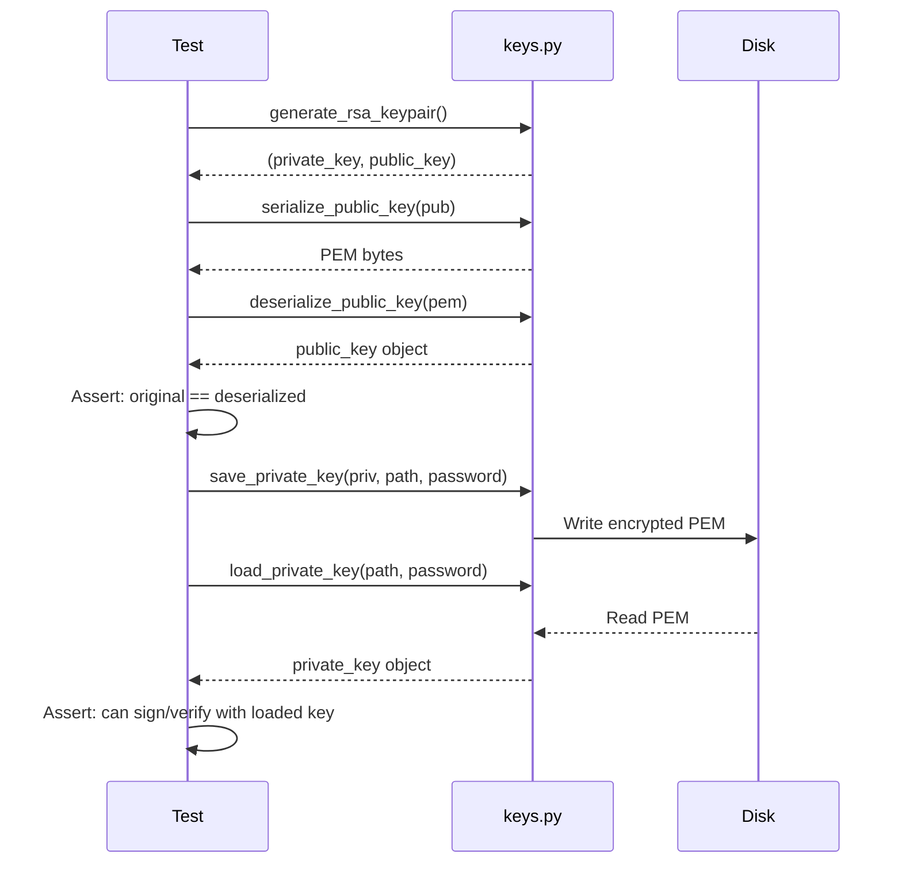

**Tests:** `test_generate_keypair`, `test_serialize_deserialize_round_trip`, `test_save_load_private_key_*`, `test_fingerprint_*`

---

### 5.2 RSA-PSS Signing & Verification (test_crypto.py)

**What it tests:** Sign data → verify with correct key (pass) → verify with wrong key/data (fail).

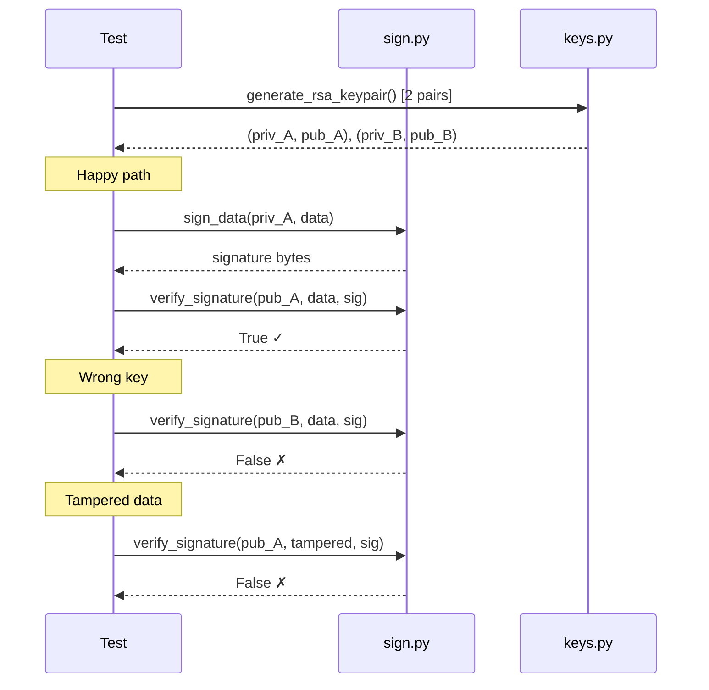

**Tests:** `test_sign_and_verify`, `test_wrong_key_rejects`, `test_tampered_data_rejects`, `test_tampered_signature_rejects`, `test_empty_data`

---

### 5.3 STS Handshake (test_crypto.py)

**What it tests:** Full 3-message STS handshake → both sides derive the same session key.

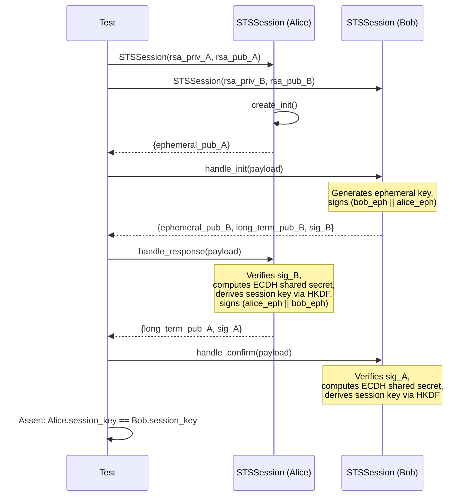

**Tests:** `test_full_handshake_produces_matching_keys`, `test_each_handshake_produces_unique_keys`, `test_tampered_*_signature_rejected`, `test_wrong_long_term_key_rejected`, `test_destroy_clears_session_key`

---

### 5.4 AES-256-GCM Encryption (test_encrypt.py)

**What it tests:** Encrypt → decrypt round-trip, tamper detection, AAD binding.

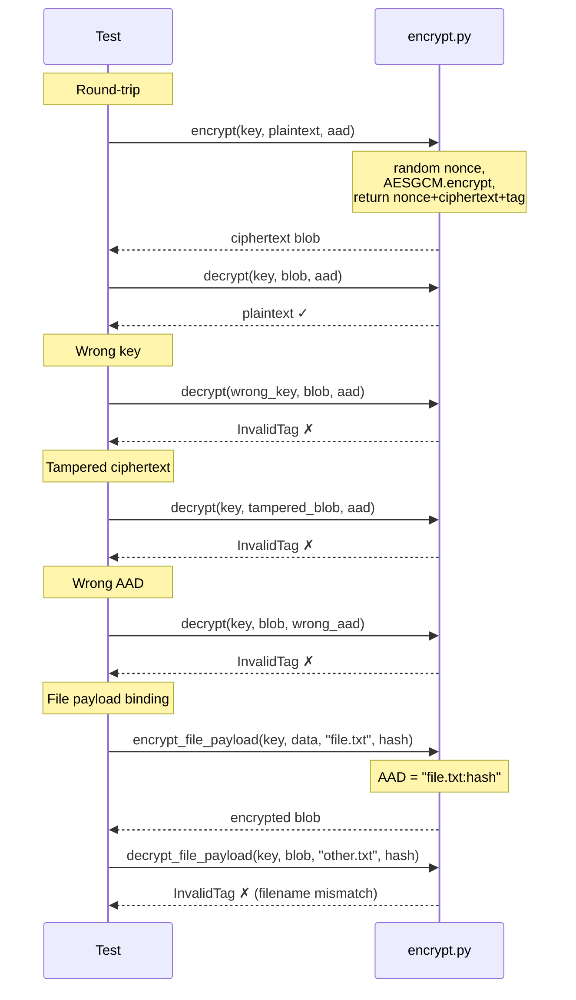

**Tests:** `test_round_trip*`, `test_wrong_key_fails`, `test_tampered_ciphertext_fails`, `test_wrong_aad_fails`, `test_missing_aad_fails`, `test_empty_plaintext`, `test_large_data`, `test_invalid_key_length`, `test_ciphertext_too_short`, `test_each_encryption_unique`, `test_file_round_trip`, `test_wrong_filename_aad_fails`, `test_wrong_hash_aad_fails`

---

### 5.5 Protocol Messages (test_protocol.py)

**What it tests:** Message creation, validation, JSON serialization, base64 round-trips.

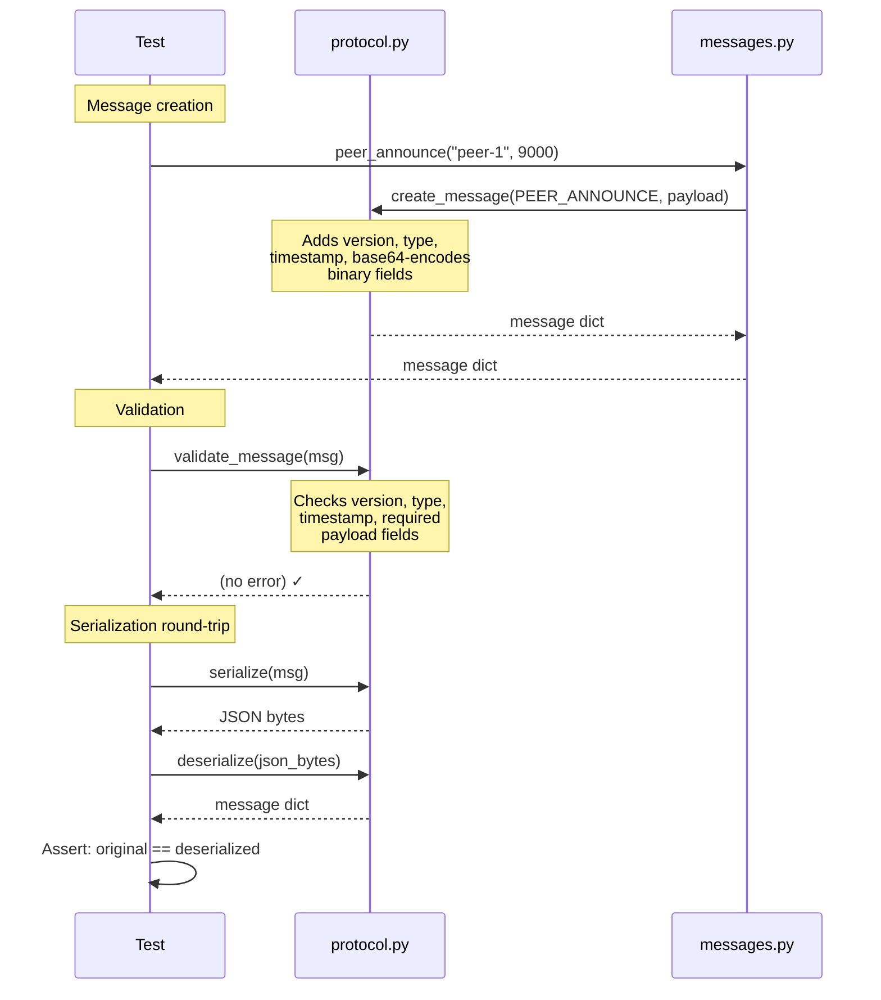

**Tests:** All 14 message builder tests, validation (missing fields, wrong version, unknown type), serialization (JSON round-trip, binary fields via base64, invalid JSON)

---

### 5.6 TCP Transport (test_transport.py)

**What it tests:** Length-prefixed send/receive over real loopback sockets, server lifecycle.

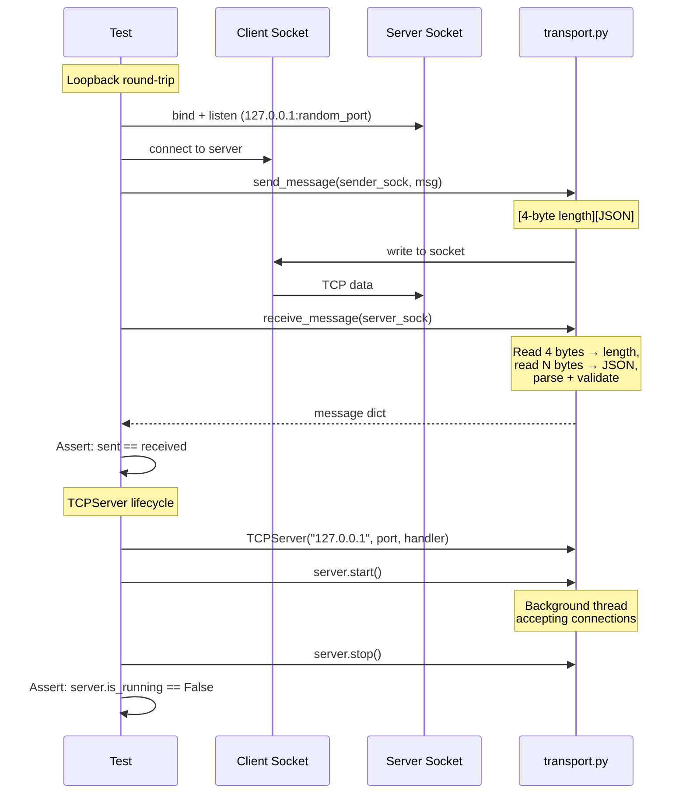

**Tests:** `test_round_trip_simple`, `test_round_trip_with_binary`, `test_clean_close_returns_none`, `test_file_list_with_multiple_entries`, `test_start_stop`, `test_accepts_connection`

---

### 5.7 Vault Storage (test_vault.py)

**What it tests:** Password-based encryption, file/JSON store-retrieve, trust records.

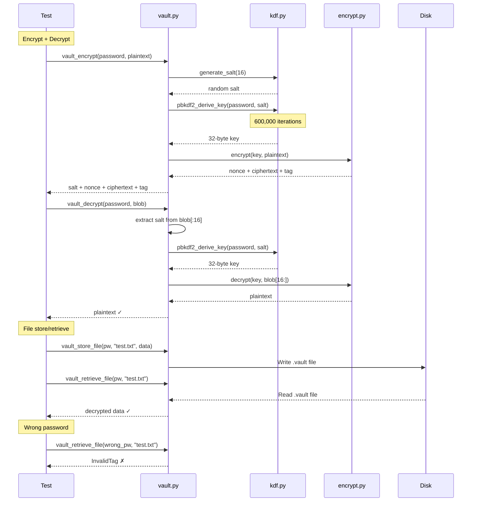

**Tests:** `test_round_trip`, `test_wrong_password_fails`, `test_blob_format`, `test_each_encryption_unique`, `test_empty_data`, `test_blob_too_short`, `test_store_and_retrieve`, `test_retrieve_nonexistent`, `test_wrong_password_on_retrieve`, `test_list_files`, `test_delete_file`, `test_json_round_trip`, `test_save_and_load` (trust records)

---

### 5.8 Third-Party Verification (test_verification.py)

**What it tests:** Verify file hash + owner signature when file came from a relay peer.

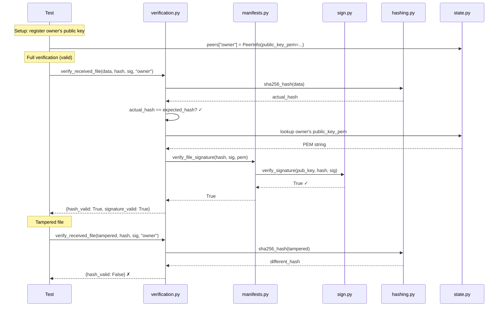

**Tests:** `test_valid_file`, `test_wrong_hash`, `test_tampered_signature`, `test_missing_signature`, `test_unknown_owner`, `test_manifest_with_valid_signature`, `test_manifest_without_signature`, `test_manifest_file_not_found`

---

### 5.9 End-to-End: File Sharing Flow (Manual / Integration)

This is the full workflow when two peers share a file. Not automated in the unit tests, but shows how all modules work together.

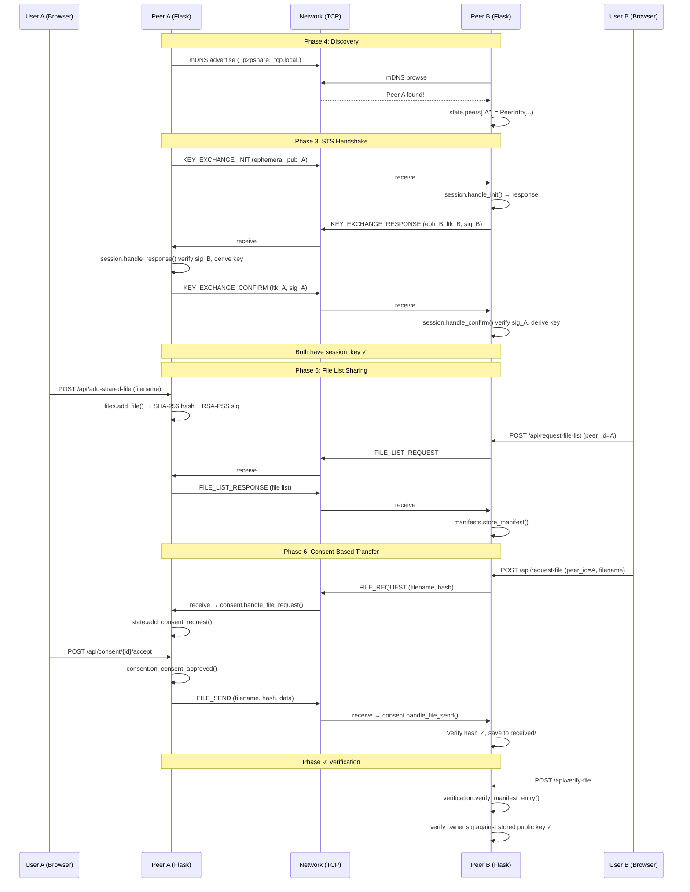

---

### 5.10 End-to-End: Key Rotation Flow (Manual / Integration)

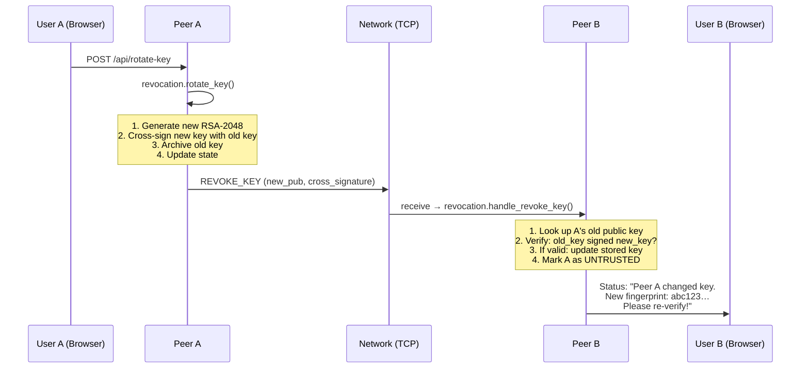

---

## 6. Test Summary Table

| Test File | Tests | Modules Exercised | Security Properties Verified |
|-----------|-------|-------------------|------------------------------|
| `test_crypto.py` | 35 | keys, sign, hashing, kdf, session | RSA-2048 gen, PSS signatures, SHA-256, HKDF/PBKDF2, STS mutual auth + PFS |
| `test_encrypt.py` | 15 | encrypt | AES-256-GCM confidentiality, integrity (tamper detection), AAD binding |
| `test_protocol.py` | 32 | protocol, messages | Message format, validation, base64 binary encoding |
| `test_transport.py` | 6 | transport, messages | Length-prefixed TCP wire format, server lifecycle |
| `test_vault.py` | 15 | vault, kdf, encrypt | At-rest encryption (PBKDF2 → AES-GCM), wrong password rejection |
| `test_verification.py` | 8 | verification, manifests, sign, hashing, state | Third-party hash + signature verification |
| **Total** | **111** | | |
