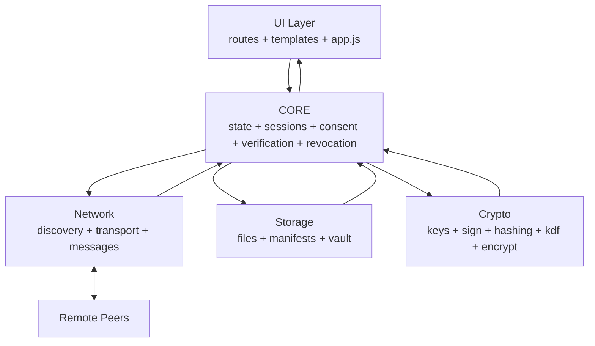

# CISC 468 - Secure P2P File Sharing Architecture

## 1. Current System Overview

This document reflects the current Python client implementation.

High-level layers:
- UI: Flask routes + templates + frontend polling/rendering.
- Core: protocol orchestration and security workflow logic.
- Network: mDNS discovery + TCP transport + message builders.
- Storage: shared files, peer manifests, encrypted vault.
- Crypto: RSA, signatures, hashing, KDFs, AEAD encryption.

Core is the center of control. It coordinates all reads/writes and all security-critical decisions.

## 2. Repository Structure (Python Client)

```text
python_client/
├── requirements.txt
├── protocol_spec.md
├── ARCHITECTURE.md
└── app/
    ├── main.py
    ├── core/
    │   ├── state.py
    │   ├── protocol.py
    │   ├── session.py
    │   ├── sessions.py
    │   ├── consent.py
    │   ├── verification.py
    │   └── revocation.py
    ├── crypto/
    │   ├── keys.py
    │   ├── sign.py
    │   ├── hashing.py
    │   ├── kdf.py
    │   └── encrypt.py
    ├── network/
    │   ├── discovery.py
    │   ├── transport.py
    │   └── messages.py
    ├── storage/
    │   ├── files.py
    │   ├── manifests.py
    │   └── vault.py
    ├── ui/
    │   ├── routes.py
    │   ├── templates/
    │   └── static/
    └── tests/
```

## 3. Module Roles Around Core

Center module group:
- `app/core/state.py`: shared in-memory runtime state.
- `app/core/sessions.py`: session lifecycle and STS integration.
- `app/core/consent.py`: consent-gated transfer workflow.
- `app/core/verification.py`: verification code + file integrity/origin checks.
- `app/core/revocation.py`: key rotation/revocation handling.
- `app/core/protocol.py`: message schema/serialization rules.

Around Core:
- UI (`app/ui/routes.py`, templates, `app.js`): user actions in, state/status out.
- Network (`app/network/discovery.py`, `transport.py`, `messages.py`): peer discovery and wire I/O.
- Storage (`app/storage/files.py`, `manifests.py`, `vault.py`): local persistence and encrypted-at-rest data.
- Crypto (`app/crypto/*`): primitives used by Core and Storage.
- Remote peers: external systems reached through Network.

## 4. Architecture Box Diagram (Core in Center)

```text
                   +-------------------------+
                   |         UI Layer        |
                   | routes, templates, JS   |
                   +-----------+-------------+
                               |
                               v
+------------------+     +-----+------+     +------------------+
|  Network Layer   | <-> |    CORE    | <-> |  Storage Layer   |
| discovery, TCP,  |     | orchestrat.|     | files, manifests,|
| messages         |     | decisions  |     | vault            |
+---------+--------+     +-----+------+     +---------+--------+
          |                    |                      |
          v                    v                      v
   +------+-------+      +-----+------+        +------+-------+
   | Remote Peers |      |   Crypto   |        | Local Disk   |
   | over network |      | RSA,KDF,   |        | manifests,   |
   |              |      | hash,AEAD  |        | vault blobs  |
   +--------------+      +------------+        +--------------+
```

## 5. Arrow Diagram (Data Flow)



## 6. Requirement Flow (1-9)

### R1. Peer discovery on local network (mDNS)
- UI requests refresh from `routes.py`.
- Core status updates in `state.py`.
- Network `discovery.py` advertises and browses `_p2pshare._tcp.local.`.
- Discovered peers update Core state and become visible in UI polling (`/api/status`).

### R2. Mutual authentication of contacts
- UI starts verification.
- Core `sessions.py` runs STS handshake using `session.py`.
- Crypto verifies signatures and derives session keys.
- Core `verification.py` generates code from fingerprints.
- UI shows code; both users confirm; Core marks peer trusted.

### R3. File request/send with consent
- UI action goes to `routes.py`.
- Core `consent.py` creates consent request message.
- Remote peer sees pending request in UI.
- On accept, Core proceeds; on deny, Core aborts and logs status.

### R4. Request file list without consent
- UI triggers file-list fetch.
- Core sends `FILE_LIST_REQUEST` through Network.
- Remote sends `FILE_LIST_RESPONSE`.
- Storage `manifests.py` stores peer manifest.
- UI renders manifest-derived file list.

### R5. Offline owner, relay from another peer with tamper verification
- Peer B uses stored manifest metadata for A's file.
- B requests same hash from peer C.
- Core `verification.py` checks hash and owner signature against trusted key/manifests.
- UI receives verified result and status messages.

### R6. Key migration / revocation
- User rotates key in UI.
- Core `revocation.py` creates new RSA keypair, cross-signs with old key.
- Network sends `REVOKE_KEY` to contacts.
- Receivers verify cross-signature, update key, set untrusted, clear session.
- Local rotation flow downgrades/removes stale trust state and clears relevant manifests.

### R7. Confidentiality + integrity in transit
- Core requires session key before transfer.
- Crypto AEAD (`encrypt.py`) encrypts with AES-256-GCM.
- Receiver decrypts and validates tag/AAD.
- Core rejects tampered payloads and reports to UI.

### R8. Perfect forward secrecy
- STS uses ephemeral ECDH per handshake.
- Session keys derived with HKDF from ephemeral secret.
- Compromise of long-term RSA key does not reveal past session plaintext.

### R9. Secure local storage at rest
- Vault uses PBKDF2-HMAC-SHA256 from user password.
- Files stored as AES-256-GCM encrypted `.vault` blobs.
- Config stores salt + verify token only (not plaintext password).
- UI setup/unlock/change-password flows route through vault APIs.

## 7. End-to-End Request Lifecycle (Short)

1. User action in UI (`app.js`) -> Flask route.
2. Route calls Core workflow (consent/session/verification/revocation).
3. Core pulls Crypto primitives and Storage data as needed.
4. Core uses Network for outbound/inbound peer messages.
5. Results + status messages are written to Core state.
6. UI polls `/api/status` and re-renders current state.

## 8. Test Status (Current)

- The suite under `app/tests/` is expected to pass locally.
- Recent runs in this workspace have passed, covering crypto, protocol, transport, vault, verification, discovery, and revocation paths.

## 9. Future Extension Note

- Requirement 1 currently uses mDNS for LAN.
- For internet-scale discovery, a DHT/bootstrapping layer would replace or augment `network/discovery.py` while preserving the same Core-centered architecture.
